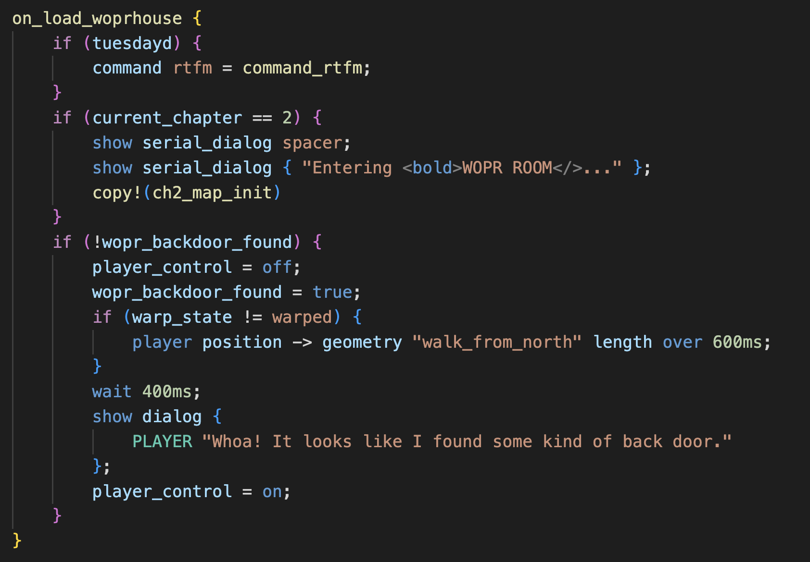

# magegamescript-colors README

Basic syntax coloring for `.mgs` files (for MageGameScript, part of the "DC801 Black Mage Game" project). (Internally this is sometimes called "natlang.")

Written by @alamedyang
